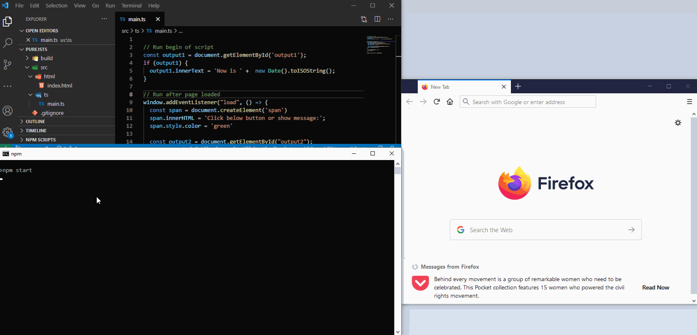

Simple website with typescript and webpack without any app (angular/react/vue/...).

## Structure

.  
├── package.json  
├── tsconfig.json  
├── webpack.config.js  
│  
├── src/  
│   ├── html/index.html  
│   └── ts/main.ts  
│  
└── build/  

* File _package.json_: Configuration of project and dependencies
* File _tsconfig.json_: Configuration of typescript
* File _webpack.config.js_: Configuration of webpack (build, run, ...)
* Directory _build_: Output of project (html, js, ...)
* Directory _src/html_: Static files of project (*.html)
* Directory _src/ts_: Code files of project (*.html)

## How use

#### Install 
``` sh
npm install
```

#### Run 
``` sh
npm start
```

Now, open internet browser and show site.



## Next
* Clone project
* Add your dependencies
* Create/Change _html file_ or _ts files_
* See result
